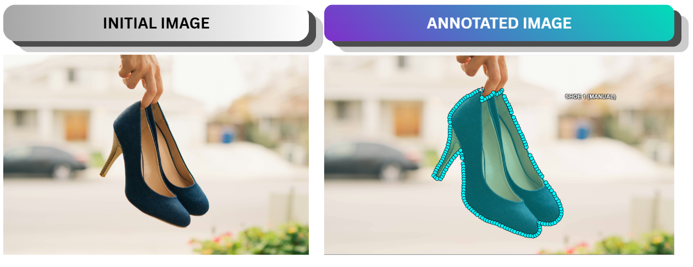
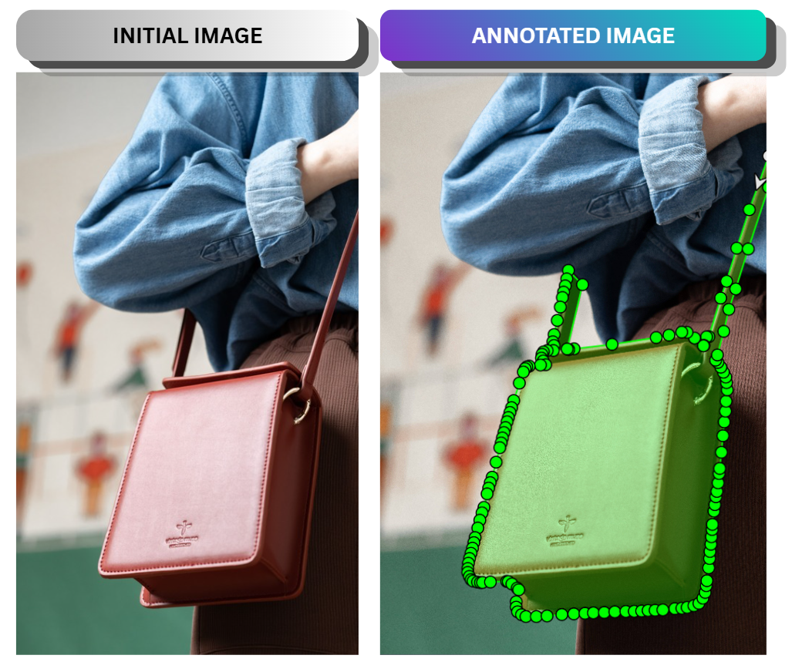
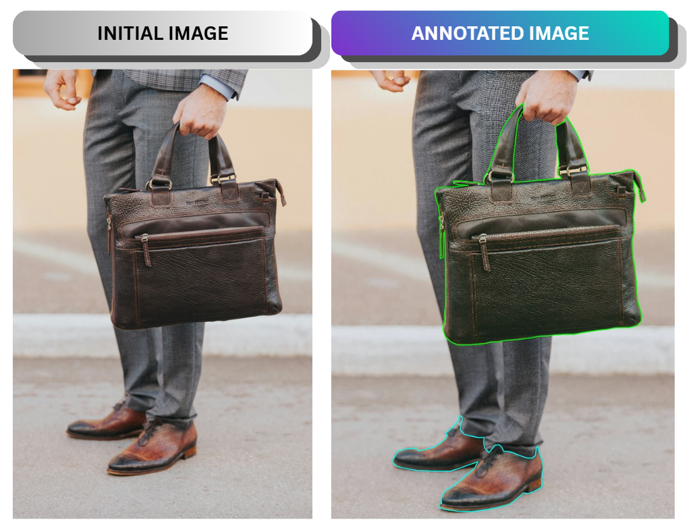

# High-Precision E-Commerce Product Annotation Dataset

## 📌 Project Overview
This repository showcases a high-quality, pixel-perfect image annotation project designed for training E-commerce AI models (Object Detection & Instance Segmentation). The focus of this dataset is to precisely isolate fashion products (shoes and bags) from various backgrounds.

- **Total Images:** 3 high-resolution images and will updated more
- **Annotation Type:** Instance Segmentation (Polygons)
- **Tools Used:** CVAT (Computer Vision Annotation Tool)
- **Output Format:** COCO JSON

---

## 🏷️ Dataset Classes
1. `sepatu` (Shoes) - Isolated from clean and complex backgrounds.
2. `tas` (Bags) - Includes challenging thin straps and handle annotations.

---

## 🖼️ Visual Samples (Before & After)
Below are the screenshots of the actual annotation work inside CVAT, demonstrating strict adherence to bounding boundaries and zero-edge leakage.

### Example 1: Shoe Instance Segmentation

*Strict polygon boundary around the shoe sole with pixel-level accuracy.*

### Example 2: Bag with Thin Straps

*Precise annotation on complex elements like thin shoulder straps and overlaps.*

### Example 3: Bag with Thin Straps

*Precise annotation on complex elements for multiple targeted objects.*

---

## 🎯 Quality Standards Applied
- **Zero Edge Leakage:** No background pixels are accidentally included within the object boundaries.
- **Handling Overlaps:** In cases where a model's hand or leg covers the product, only the visible pixels of the product are labeled.
- **Tight Fit:** Polygons are packed closely around organic curves.

---

## 📥 How to Use this Dataset
The annotations are exported in standard **COCO JSON** format, which is fully compatible with modern computer vision pipelines like YOLOv8, Detectron2, or Mask R-CNN. 
